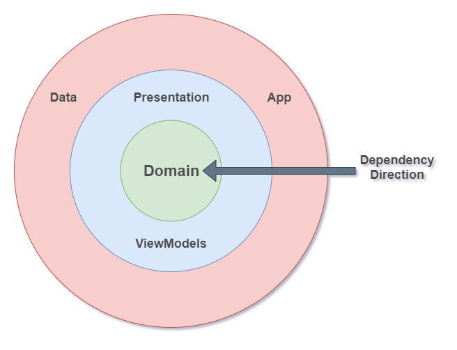
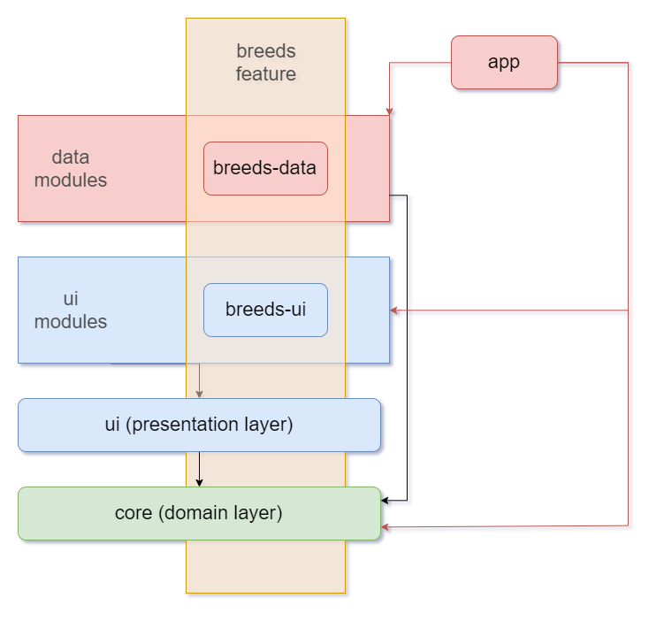

# Puvi

Take home test as part of the Cuvva interview process. Submitted by Allan Yoshio Hasegawa.

The main features of the app:

1. List breeds of dogs from the Dog CEO API (https://dog.ceo/dog-api/)
1. Clicking on a breed takes to a list of images for that breed
1. The list of breeds and the images are locally cached
1. Fresh content is fetched while the user uses the app
1. Connection or network errors are gracefully handled

# Running

To run the app just open it on AndroidStudio and run the `app` module.
The project was tested with Android Studio 3.5.3.

Because of code-generation during compile time, if it doesn't work,
try running `gradlew clean` before running it again.

## Lint

Run the command from the root directory:

```
$ ./gradlew ktlintcheck
```

## Unit tests

Run the command from the root directory:

```
$ ./gradlew clean testDebugUnitTest
```

## Instrumentation tests

Run the command from the root directory:

```
$ ./gradlew clean connectedAndroidTest
```

Ps.: Make sure you have **one** device running and connected to ADB.

# Architecture

The app was implemented following the Clean Architecture.
The dependency injection uni-direction is clearly expressed.
The app has very low coupling with implementation details like databases and frameworks.
All components are easily testable in isolation.

The code uses the "package by feature" then "package by layer" pattern.

## Dependency Inversion Principle

The architecture uses a uni-direction dependency injection so that the app doesn't have a hard dependency to a particular implementation.

See the following diagram:



The circles represent the layers.

In the middle we have the **domain** layer. Here we have:

* Common data transfer objects used by the features
* Business logic with Use Cases
* Interfaces for our data sources

Note how the **domain** layer has *no dependencies*.
It doesn't know anything about the Android Framework or any specific implementation.
Changes to a different database implementation, as an example,  should not affect this module at all.

Then we have the **presentation** layer where UI logic is present.
Note that the **presentation** layer depends only on the **domain** layer,
so it also doesn't need to change in case of implementation changes to data sources.

The outer layer is where the Android Framework and implementation of our **data** layer is.
This is where we actually implement the interfaces declared in the **domain** layer.

## Modules

The app uses a multi-modules architecture. Modules are structured in a *matrix style* that respects the Clean Architecture:



Each feature can have a **ui** module and a **data** module, although it's not a requirement.
Features with no UI elements can have just a **data** layer, for example.

The **core** module is the **domain** layer. It depends on nothing, but all features depend on it.
The **core** module is a **pure Kotlin** module, so it could be used in others projects, like in a *Swift* app ;)

The **ui** modules are our **presentation** layer and depends only on the **core** module.
All features with **ui** elements depend on it.
It's in the **ui** module that we can put Android resources shared through the app like *styles*, *drawables* and *colors*.

The **data** modules are the implementation of our *data sources*.

The **app** module depends on everything, and the main reason is because it's in this module where the DI and navigation is implemented.

## UseCases

UseCases are implemented in the **domain** layer. This means they only depend on interfaces for services and repositories.

Any other layer that interacts with the **core** does it through UseCases.
This makes a lot easier to understand what actions the app are doing.
Also, this usually means we have a single place to look when an action is doing something wrong.

Because they don't depend on Android Framework, by moving most of our logic to inside use cases,
we can even share this codebase with others projects from different platforms ;)

## Presentation

The **presentation** layer for this app is extremely thin and there's not much going on.

It's using the normal MVVM with Android Jetpack Components like the `ViewModelProvider`.

For more complex UI I like to use [Kelm](https://github.com/AllanHasegawa/kelm).
Kelm is used in place of patterns like MVI and MVVM.
However, due to the simplicity of this app it wasn't needed.

## Single Activity and navigation

The app is built with the Single Activity pattern in mind. All the navigation is done using the Navigation Component from Jetpack.

This pattern drastically simplifies navigation inside the app.

# Tests

The entire architecture is built to be easily testable.
Although, I like to follow the *testing pyramid*,
where we write a lot of unit tests, fewer integration tests,
and even fewer E2E tests.

On an Android app we can divide tests in two dimensions:

* *Coverage*: Unit or Integration
* *Runtime*: JVM (actual JVM, with our without Robolectric) or on Android Device with Instrumentation

## Unit tests for UseCases (runs on JVM)

Use cases sit in the **core** module.
It makes it fairly simple to test as mocking its dependencies is easily done.

Check the `FetchBreedsListUseCaseTest` to see an example of it in action.

## Unit tests for the data layer (runs on JVM)

The data layer is very dependant on the framework for tests.
A Retrofit implementation will require a WebServer, see `RetrofitBreedsServiceTest` to see
how a `MockWebServer` can help us Unit test a API connection.

We could've easily used Robolectric to test the SharedPreferences implementations.
Omitted because of the lack of time.

## Integration tests (runs on a device)

Integration tests are more time consuming to write, and should be reserved for bigger flows,
usually involving more than one screen.

The test `DetailFlowTest` shows how this architecture allows for integration tests.

Using a combination of `Mockk` and `Motif`, we can spy on the main `AppScope` and replace
the lowest level dependencies, like services and repository, with mocks.
This allows for the entire app to be tested at once:
UseCases, ViewModels, Activities, Fragments, UI, Navigations, etc.
Even the DI injection framework is tested in this way.

## Unit tests for UI logic (runs on JVM)

The UI doesn't really have a lot of logic, so there's nothing much to test.

For bigger projects I would have used Kelm and it's a perfect pattern to test stuff.

See a test example here: https://github.com/AllanHasegawa/kelm/blob/master/sample-android/src/test/java/kelm/sample/CounterElementTest.kt

## Unit tests for UI views (runs on a Device)

No tests for lack of time, but note how most of the Views take a `state` as input and is only
responsible to show it on screen. The UI is super dumb and passive, and has zero logic in it.
This allows for easy Unit testing of the UI.

# Cool things

* Motif: A new DI framework from Uber that simplifies creation of DI scopes but is as fast and efficient as Dagger during runtime.
* `FetchAllBreedImagesUseCase`: This use case implements a fairly complex logic. It fetches data from cache, and it auto-updates the list of breeds and their images. All errors and edge cases are handled elegantly ;)
* Groupie: No more coding RecyclerView Adapter `\o/`. Groupie helps us by doing a `diff` between two states, and only updating the UI elements that changed. This goes very well with how the MVVM was implemented here. Not as good as Compose (from Jetpack), but still pretty good.
* Reactive: The entire architecture is reactive. This means that any component adding an image, for example, will instantly update the breed's images reflecting it. Pretty cool! This also prevents we caching stale data in-memory and having weird behaviours hard to debug, usually done by app-wide side-effects (ugh).
